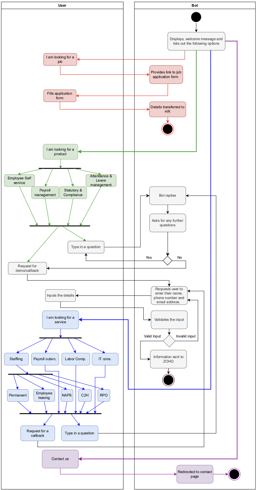

# AI Sales Chatbot

## Executive Summary

This project involves the design, development, and deployment of a chatbot for the Datacore website using the Rasa 3.x framework. The chatbot is designed to engage users by answering questions about products and services, gathering leads, and transferring them to Zoho CRM for further processing. The chatbot is deployed using Okteto Kubernetes service, with Botfront as the frontend, and MongoDB Atlas as the backend database.

## Business Problem

Businesses often struggle with efficiently capturing and processing leads from their website traffic. The Datacore Chatbot addresses this problem by automating the initial interaction with potential customers, reducing the need for direct human involvement in answering common queries, and ensuring that all leads are captured and processed promptly. This leads to improved customer engagement, higher conversion rates, and a more streamlined sales process.

## Methodology

### Architecture

The chatbot is built using the Rasa framework, which allows for robust conversational AI development. The key components of the system are:

- **Rasa 3.x**: The core engine for managing conversations and processing natural language inputs.
- **Botfront**: Used as the frontend interface for the chatbot, providing a user-friendly interaction layer on the Datacore website.
- **MongoDB Atlas**: Acts as the database for storing conversation data and other relevant information.
- **Okteto Kubernetes**: The chatbot is deployed on the Okteto Kubernetes service for scalable and reliable deployment.

### Workflow

The chatbot's workflow involves the following steps:

1. **User Interaction**: Visitors to the Datacore website interact with the chatbot through the Botfront interface. They can ask questions, request information, or inquire about services.
2. **Lead Generation**: The chatbot captures leads by collecting user information, such as name, email, and phone number.
3. **Data Handling**: All captured data is stored in MongoDB Atlas and is subsequently transferred to Zoho CRM for further processing and follow-up.
4. **Deployment**: The bot is deployed in a scalable environment using Okteto Kubernetes, ensuring high availability and performance.

### Workflow Diagram
Below is a placeholder for the workflow diagram. Please replace the link with your diagram.



### Setup and Installation

#### Prerequisites

- Docker
- Rasa 3.x
- MongoDB Atlas account
- Okteto account

#### Installation

1. **Clone the Repository**:
   ```bash
   git clone https://github.com/yourusername/datacore-chatbot.git
   cd datacore-chatbot
   ```

2. **Build and Run the Docker Container**:
   Ensure Docker is installed and running on your machine.
   ```bash
   docker-compose up --build
   ```

3. **Deploy to Okteto Kubernetes**:
   Ensure you have configured your Okteto account and Kubernetes context.
   ```bash
   okteto stack deploy --build
   ```

4. **Run the Rasa Server**:
   Start the Rasa server locally for testing.
   ```bash
   rasa run --enable-api --cors "*"
   ```

5. **Access the Botfront Interface**:
   Visit the Datacore website where the chatbot is integrated via Botfront.

### Configuration Files

- **`config.yml`**: Contains the pipeline and policies for the Rasa NLU and Core.
- **`credentials.yml`**: Stores credentials for connecting to external services like MongoDB and Botfront.
- **`docker-compose.yml`**: Defines the services and networks for Docker deployment.
- **`domain.yml`**: Specifies intents, entities, slots, templates, and actions for the chatbot.
- **`endpoints.yml`**: Configures the endpoints for action servers and other services.
- **`okteto.yml`**: Defines the deployment configuration for Okteto Kubernetes.


### Technical Stack

- **Rasa 3.x**: Conversational AI framework.
- **Botfront**: Frontend for chatbot interactions.
- **MongoDB Atlas**: Database for storing conversation data.
- **Okteto Kubernetes**: Platform for deploying the chatbot.
- **Docker**: Containerization for easy deployment.

## Results

The Datacore Chatbot successfully automates customer interaction on the Datacore website, ensuring that leads are captured effectively and transferred to Zoho CRM for further processing. The chatbot's deployment on Okteto Kubernetes ensures scalability, reliability, and ease of maintenance.

## Next Steps

To further enhance the Datacore Chatbot, the following improvements are suggested:

1. **Advanced NLP Features**: Integrate more advanced natural language processing features to handle a wider range of customer queries.
2. **Multilingual Support**: Extend support for multiple languages to cater to a global audience.
3. **Analytics Integration**: Add analytics to monitor chatbot performance and user interactions.
4. **AI-Powered Personalization**: Implement AI-driven features to personalize interactions based on user behavior and preferences.

---

**Company Confidential**

This README provides a comprehensive overview of the Datacore Chatbot project, including its architecture, methodology, and deployment instructions. All details are subject to change as the project evolves.
